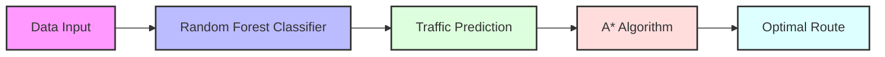

# 🚦 Traffic Flow Prediction & Route Optimization

#### *Smart Urban Transportation Solution using Machine Learning*


## 📋 Project Overview

This project addresses urban traffic congestion through an innovative combination of machine learning and pathfinding algorithms. By accurately predicting traffic flow and optimizing route selection, we aim to reduce travel times and improve urban mobility.

### 🎯 Key Objectives

- Predict traffic congestion levels using vehicle count data
- Optimize route selection using traffic-aware pathfinding
- Reduce average travel time in urban environments

## 🔬 Methodology

### Data Analysis

Our model processes various traffic-related features:

- 🕒 Time of day
- 📅 Day of week
- 🚗 Vehicle counts:
  - Cars
  - Bikes
  - Buses
  - Trucks

### Traffic Classification

Traffic situations are categorized into four levels:

- 🟢 Low: Minimal traffic
- 🟡 Normal: Standard flow
- 🟠 High: Elevated congestion
- 🔴 Heavy: Severe congestion

## 💻 Technical Implementation

### Machine Learning Models

#### 1. Naive Bayes Classifier (Initial Approach)

- Simple probabilistic classifier
- Performance: ~60% accuracy
- Limited by feature independence assumption

#### 2. Random Forest Classifier (Final Solution)

- Ensemble learning method
- Performance: 99.9% accuracy
- Captures complex feature interactions

```python
# Model prediction formula
y = f(Day, Car_Count, Bike_Count, Bus_Count, Truck_Count)
```

### Route Optimization

Implemented A* algorithm with traffic-aware heuristics:

```math
f(n) = g(n) + h(n)
```

where:

- `f(n)`: Total estimated path cost
- `g(n)`: Cost from start to node n
- `h(n)`: Estimated cost from n to goal

## 📊 Results

### Model Performance

| Model         | Accuracy | Key Feature     |
| ------------- | -------- | --------------- |
| Naive Bayes   | 60%      | Fast, simple    |
| Random Forest | 99.9%    | Highly accurate |

### Route Optimization Achievements

- ⬇️ Reduced average travel time
- 🚫 Effective congestion avoidance
- 🎯 Dynamic route adaptation

## 🔄 System Architecture



## 🚀 Future Enhancements

### Potential Improvements

1. **Data Enrichment**

   - Weather conditions integration
   - Special events consideration
   - Road work information
2. **Model Optimization**

   - Computational efficiency improvements
   - Real-time processing capabilities
   - Alternative pathfinding algorithms
3. **Feature Expansion**

   - Historical traffic patterns
   - Seasonal variations
   - Emergency vehicle routing

## 👥 Team Members

- Tejas Pakhale (202211061)
- Rajat Kumar Thakur (202211070)
- Tanay Patel (202211094)
- Abhi Tundiya (202211095)

## 📚 References

1. Horvat, R., Kos, G., & Ševrović, M. (2015). Traffic Flow Modelling on the Road Network in the Cities.
2. Kim, J., & Wang, G. (2014). Diagnosis and Prediction of Traffic Congestion on Urban Road Networks Using Bayesian Networks.
3. Zhou, Z.-H., & Jiang, Y. (2012). Random forests and decision trees.

---

*Project developed as part of the Artificial Intelligence course*
